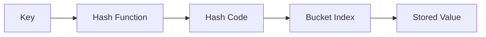
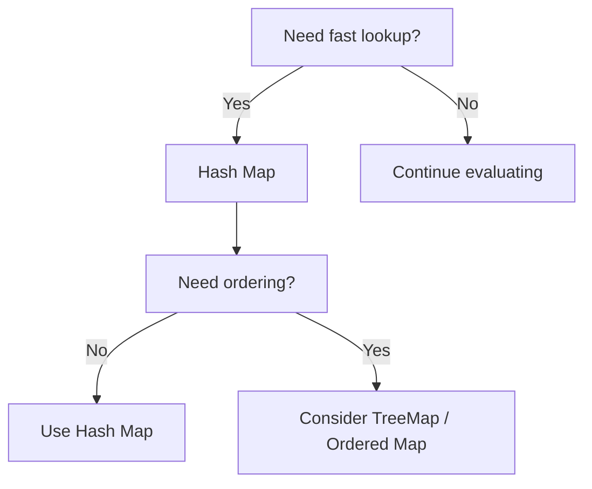

# 🗂️ Hash Maps

> [!NOTE]
> **Difficulty:** ⭐ Beginner
>
> **Category:** Data Structure
>
> **Common Time Complexity:** **O(1)** average lookup
>
> **Common Space Complexity:** **O(n)**

---

# Table of Contents

- [Definition](#definition)
- [Characteristics](#characteristics)
- [Internal Structure](#internal-structure)
- [How a Hash Map Works](#how-a-hash-map-works)
- [Hashable Objects](#hashable-objects)
- [Hash Function](#hash-function)
- [Hash Collisions](#hash-collisions)
- [Operations](#operations)
- [Complexity Analysis](#complexity-analysis)
- [Advantages](#advantages)
- [Limitations](#limitations)
- [Pattern Recognition](#pattern-recognition)
- [Common Applications](#common-applications)
- [Code Examples](#code-examples)
- [Common Interview Problems](#common-interview-problems)
- [Common Mistakes](#common-mistakes)
- [Summary](#summary)

---

# Definition

A **Hash Map** (also referred to as a **Hash Table** or **Dictionary**) is a data structure that stores information as **key-value pairs**, allowing efficient insertion, retrieval, update, and deletion of data through the use of a **hash function**.

Unlike sequential data structures, where locating an element may require scanning multiple positions, a Hash Map computes the storage location directly from the key, making element access nearly instantaneous under normal conditions.

---

## Key Concepts

A Hash Map is composed of three fundamental elements:

| Component | Description |
|-----------|-------------|
| **Key** | Unique identifier used to access a value. |
| **Value** | Data associated with the key. |
| **Hash Function** | Function that converts the key into an array index. |

---

## Key-Value Relationship

```
Key ─────────► Value
```

Example:

```
Student ID ─────────► Student Name

1023 ───────────────► Alice
1054 ───────────────► Bob
2031 ───────────────► Charlie
```

Another example:

```
Country

↓

Capital

Brazil  → Brasília
Japan   → Tokyo
France  → Paris
```

---

# Characteristics

| Property | Value |
|----------|-------|
| Data Organization | Key → Value |
| Ordered | Depends on implementation |
| Duplicate Keys | ❌ No |
| Duplicate Values | ✅ Yes |
| Mutable | ✅ Yes |
| Average Lookup | O(1) |
| Worst Lookup | O(n) |

---

# Why Hash Maps Exist

Suppose we want to determine whether a student named **Emma** exists in a list.

## Without a Hash Map

```
Alice
Bob
Charlie
Daniel
Emma
Frank
```

The program checks every element until it finds Emma.

Worst case:

```
Alice
↓

Bob
↓

Charlie
↓

Daniel
↓

Emma
```

Time Complexity:

```
O(n)
```

---

## With a Hash Map

```
{
    "Alice": 91,
    "Bob": 84,
    "Emma": 99
}
```

Lookup:

```
Emma

↓

99
```

Average complexity:

```
O(1)
```

Instead of searching sequentially, the key is transformed directly into a storage location.

---

# Internal Structure

Conceptually, a Hash Map can be viewed as an array.

```
Index

0
1
2
3
4
5
6
7
8
...
```

Each position is called a **bucket**.

The hash function determines which bucket stores each key.

```
Key

↓

Hash Function

↓

Bucket

↓

Stored Value
```

---

## Example

Suppose we insert:

```
"apple" : 15
```

The process becomes:

```
"apple"

↓

hash("apple")

↓

Bucket 7

↓

Store 15
```

Searching follows exactly the same path.

```
"apple"

↓

hash("apple")

↓

Bucket 7

↓

Return 15
```

---

# How a Hash Map Works

The process consists of four steps.

## Step 1

Receive a key.

```
"banana"
```

↓

## Step 2

Apply the hash function.

```
hash("banana")
```

↓

## Step 3

Generate an integer.

Example:

```
38472919
```

↓

## Step 4

Convert that integer into a valid array position.

```
38472919 % table_size

↓

Bucket 23
```

The value is stored at Bucket 23.

---

# Visual Representation



---

# Hash Function

A **hash function** transforms a key into a deterministic integer.

A good hash function should satisfy the following properties.

| Property | Description |
|-----------|-------------|
| Deterministic | Same key always produces the same hash. |
| Fast | Must execute in constant time. |
| Uniform | Keys should be evenly distributed across buckets. |
| Collision Resistant | Different keys should rarely map to the same bucket. |

---

## Example

```
hash("cat")

↓

498273
```

```
498273 % 16

↓

1
```

Store at Bucket 1.

---

# Hashable Objects

Not every object can be used as a key.

A key must be **hashable**, meaning:

- It has a hash value.
- Its hash value never changes during its lifetime.

---

## Common Hashable Types

| Python Type | Hashable |
|-------------|----------|
| int | ✅ |
| float | ✅ |
| bool | ✅ |
| str | ✅ |
| tuple | ✅ (if immutable) |
| bytes | ✅ |

---

## Non-Hashable Types

| Python Type | Reason |
|-------------|--------|
| list | Mutable |
| dict | Mutable |
| set | Mutable |

Example:

```python
my_dict = {}

my_dict[[1, 2, 3]] = "value"
```

Result:

```python
TypeError: unhashable type: 'list'
```

Lists can change after insertion, invalidating the computed hash.

---

# When Should You Think About Using a Hash Map?

A Hash Map is usually the correct choice when a problem requires **fast lookup**.

Typical interview phrases include:

- "Have we seen this value before?"
- "Find duplicates."
- "Return the index."
- "Count occurrences."
- "Store previous results."
- "Check membership."
- "Associate two datasets."

---

## Decision Tree



---

# Common Applications

| Application | Description |
|--------------|-------------|
| Frequency Counting | Count occurrences of elements. |
| Memoization | Store previously computed results. |
| Caching | Avoid repeated expensive computations. |
| Database Indexing | Fast record retrieval. |
| Symbol Tables | Variable lookup in compilers. |
| Graph Representation | Adjacency maps. |
| Duplicate Detection | Membership testing. |

---

# Operations

The four most common operations performed on a Hash Map are:

| Operation | Description |
|-----------|-------------|
| Insert | Add a new key-value pair. |
| Search | Retrieve the value associated with a key. |
| Update | Modify an existing value. |
| Delete | Remove a key-value pair. |

The following sections explain each operation individually.
